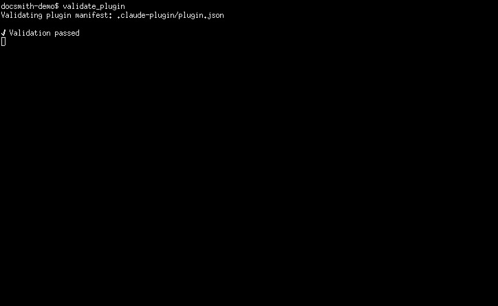
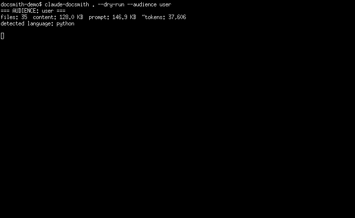
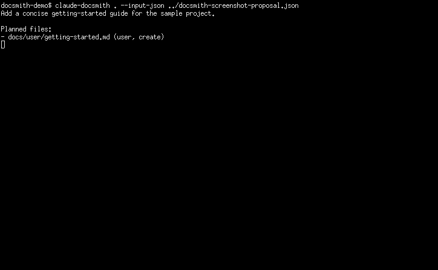
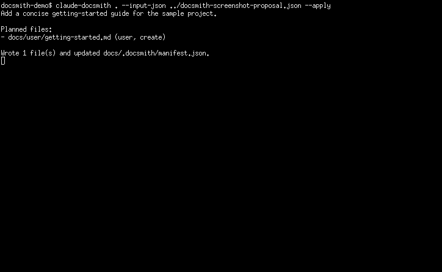

# Demo and Screenshots

This page walks through using `claude-docsmith` end-to-end. Screenshots show the experience inside Claude Code.

---

## Workflow A: Claude Code plugin (recommended)

### Step 1 — Install the plugin

```
/plugin marketplace add nikolareljin/claude-plugins
/plugin install claude-docsmith@nikolareljin-plugins
```

For a local checkout, validate the plugin manifest before opening the session:

```bash
claude plugin validate .
```



### Step 2 — Open Claude Code in your target repository

```bash
cd /path/to/your-project
claude
```

### Step 3 — Invoke the skill

Type the command in the Claude Code session:

```
/claude-docsmith:nr-update-docs
```

Claude reads your repository structure, existing docs, config files, and source and proposes updated documentation.



### Step 4 — Review the proposed file set

Claude lists the files it plans to create or update, along with a summary of changes and any open questions.



### Step 5 — Confirm and apply

Approve the proposed changes. Claude writes the updated documentation files into your repository.



---

## Workflow B: CLI with Claude API

```bash
# Generate. With no --model, the newest model your key can see is used
# and printed to stderr; add --model <name> to pin one.
claude-docsmith /path/to/repo \
  --provider claude \
  --output-json docsmith-output.json

# Review
cat docsmith-output.json

# Apply
claude-docsmith /path/to/repo \
  --input-json docsmith-output.json \
  --apply
```

---

## Workflow C: CLI with local Ollama

```bash
# Start Ollama and make sure at least one model is pulled
ollama list

# Generate. With no --model, the most recently modified installed model
# is used and printed to stderr; add --model <name> to pin one.
claude-docsmith /path/to/repo \
  --provider ollama \
  --output-json docsmith-output.json

# Apply
claude-docsmith /path/to/repo \
  --input-json docsmith-output.json \
  --apply
```

---

## Capturing documentation screenshots

The user-documentation workflow first searches existing image assets. When a new
capture is useful, it proposes the target and key states and waits for approval
before accessing a device or window.

It selects an available local tool for the interface:

- Playwright for browser pages
- ADB for approved Android devices or emulators
- installed Apple debugging tools for supported targets
- a CLI/TUI capture utility for terminal interfaces
- a native window or region capture tool for desktop applications

Captured PNG files use stable ids. The workflow inspects each image, recaptures
screens that expose sensitive or personal information, updates the page with
descriptive alt text, and records the result in the user screenshot manifest.
When capture is unavailable, the page shows a visible pending callout and the
manifest records reproducible steps plus the blocker.

The screenshots on this page are real captures from a controlled demo session:

| File | What it shows |
|------|---------------|
| `install.png` | Plugin manifest validation |
| `invoke.png` | User-track dry-run context summary |
| `review.png` | Proposed user documentation file |
| `result.png` | Completed documentation update |
